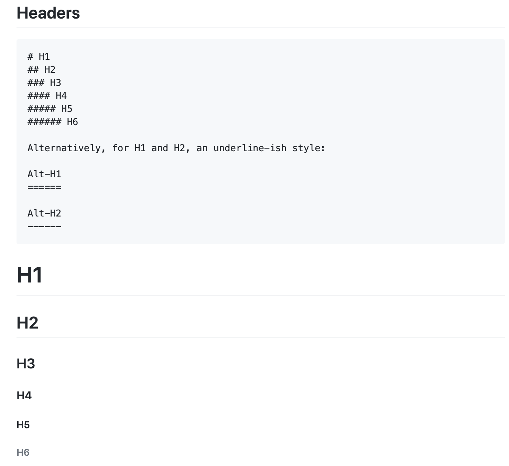

[Markdown](https://daringfireball.net/projects/markdown/){:target="_blank"} is a text to HTML conversion tool. It provides you a way to write
text in an easily readable and structured format using it's non-alphabetic characters like <code>#</code> or <code>*</code>. Markdown is written in Perl.

<!--more-->

<figure>

</figure>

The main goal of Markdown is to make text as much readable as possible. An HTML page with lots of tags is very difficult to read. Markdown
internally converts the web page into XHTML or HTML. Thus makes the life of developer easy.

> The following content is based on my knowledge extracted from the github [article](https://github.com/adam-p/markdown-here/wiki/Markdown-Cheatsheet){:target="_blank"}

#### Emphasis

<code> Text can be italicized using *asterisk* or _underscore_. </code> *Italicized*

<code> Bold text with **asterisk** or __underscore. </code> **Strong emphasis**

<code> Strikethrough done using two tildes. </code> ~~Striked~~

#### Lists

<pre>
Ordered Lists
1. MI
2. CSK
Unordered Lists
* Rohit Sharma.
* Mahendra Singh Dhoni.
</pre>

1.  MI
2.  CSK

* Rohit Sharma
* Mahendra Singh Dhoni

This line is also a separate paragraph, but...
This line is only separated by a single newline, so it's a separate line in the *same paragraph*.

#### Links
<code>[example.com website built by Internet Assigned Numbers Authority](http://example.com){:target="_blank"}</code>

[example.com website built by Internet Assigned Numbers Authority](http://example.com){:target="_blank"}

For links within a page do like following

<code>[Code and Syntax Highlighting](#code-and-syntax-highlighting)</code>

[Code and Syntax Highlighting](#code-and-syntax-highlighting)

#### Images
<pre>
Jekyll-logo:

Hover over the image to display title text
</pre>

Jekyll-logo:


#### Code and Syntax Highlighting
<code>Inline `code` done using back-ticks around text to mark as code</code>

Inline `code` is done using `back-ticks` around text to mark as code

<pre>
Adding property to javascript object only if the property is defined is done as follows
const a = {
...(someCondition && {b: 20})
}
You can see below how keywords and variables are highlighted
</pre>

```javascript
var a = {
...(someCondition && {b: 20});
};
```

#### Blockquotes
<code> > These are very helpful to emulate reply text in email </code>

>These are very helpful to emulate reply text in email

#### Inline HTML
We can use HTML tags within markdown page.
<pre>
&lt;svg width="100" height="100">
  &lt;circle cx="50" cy="50" r="40" stroke="green" stroke-width="4" fill="yellow" />
  Sorry, your browser does not support inline SVG.
  &lt;ellipse cx="35" cy="40" rx="6" ry="6" stroke="green" stroke-width="3" fill="yellow"/>
  &lt;ellipse cx="65" cy="40" rx="6" ry="6" stroke="green" stroke-width="3" fill="yellow"/>
  &lt;path d="M35 60 C 35 60, 50 75, 65 60" stroke="green" stroke-width="3" fill="transparent"/>
</svg>
</pre>

The above code will generate below graphic

<svg width="100" height="100">
  <circle cx="50" cy="50" r="40" stroke="green" stroke-width="4" fill="yellow" />
  Sorry, your browser does not support inline SVG.
  <ellipse cx="35" cy="40" rx="6" ry="6" stroke="green" stroke-width="3" fill="yellow"/>
  <ellipse cx="65" cy="40" rx="6" ry="6" stroke="green" stroke-width="3" fill="yellow"/>
  <path d="M35 60 C 35 60, 50 75, 65 60" stroke="green" stroke-width="3" fill="transparent"/>
</svg>

#### Horizontal Rule
<pre>
Three or more - or * or _
---

Hyphens

***

Asterisks

___

Underscores
</pre>
---

Hyphens

***

Asterisks

___

Underscores